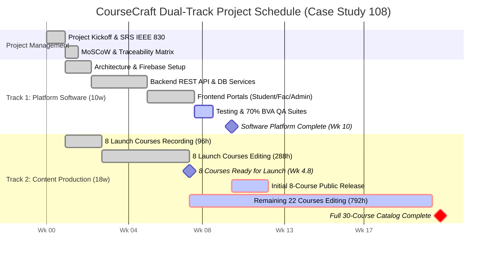

# Gantt Chart (Dual-Track Schedule)
## CourseCraft — Case Study No. 108

The Gantt chart illustrates the concurrent execution of **Track 1 (Platform Software Engineering)** and **Track 2 (Video Content Production)** across 22 total calendar weeks.

