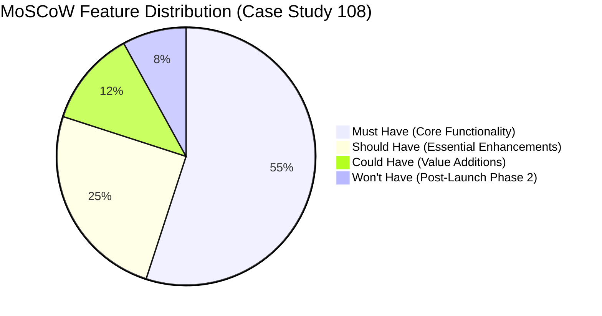

# MoSCoW Prioritization Matrix
## CourseCraft — Case Study No. 108

The MoSCoW method categorizes project requirements into four priority buckets to guide engineering sprints and release management for the 10-week software dev and 18-week content timelines.

---

### 1. Must Have (P0 — Release Blockers for Week 10 Launch)
These requirements are non-negotiable for the Initial 8-Course Release at Week 10.
- **M-01:** Multi-role Authentication (Student, Faculty, Admin) and 1-click test personas ([FR-02](file:///Users/swetapopatkadam/Downloads/CourseCraft/docs/Requirements.md)).
- **M-02:** 30-Course Catalog Browser with search, category filtering, and status badges ([FR-01](file:///Users/swetapopatkadam/Downloads/CourseCraft/docs/Requirements.md)).
- **M-03:** 12-Hour Video Learning Studio with 4 modules, 16 lessons, and video streaming ([FR-04](file:///Users/swetapopatkadam/Downloads/CourseCraft/docs/Requirements.md)).
- **M-04:** Video progress telemetry & auto-sync with persistence layer ([FR-05](file:///Users/swetapopatkadam/Downloads/CourseCraft/docs/Requirements.md)).
- **M-05:** 10-Question timed certification assessment with 70% passing threshold ([FR-06](file:///Users/swetapopatkadam/Downloads/CourseCraft/docs/Requirements.md), [FR-07](file:///Users/swetapopatkadam/Downloads/CourseCraft/docs/Requirements.md)).
- **M-06:** Cryptographic Certificate Generation with unique Certificate ID & print/PDF export ([FR-08](file:///Users/swetapopatkadam/Downloads/CourseCraft/docs/Requirements.md)).
- **M-07:** Course enrolment checkout with ₹4,500 demo payment gateway and transaction logging ([FR-03](file:///Users/swetapopatkadam/Downloads/CourseCraft/docs/Requirements.md)).
- **M-08:** Executive CPM schedule analyzer (18w content vs 10w software) & revenue tracker ([FR-11](file:///Users/swetapopatkadam/Downloads/CourseCraft/docs/Requirements.md), [FR-12](file:///Users/swetapopatkadam/Downloads/CourseCraft/docs/Requirements.md)).
- **M-09:** Live Firebase configuration connecting to project `coursecraft-c31f9`.

### 2. Should Have (P1 — High Value for Early Adopters)
- **S-01:** Public certificate verification endpoint (`/api/certificates/:id`) ([FR-09](file:///Users/swetapopatkadam/Downloads/CourseCraft/docs/Requirements.md)).
- **S-02:** In-app student personal notes scratchpad per lesson with local autosave.
- **S-03:** Interactive Case Study 108 parameters simulator on landing page and admin dashboard.
- **S-04:** Toast notification feedback system for asynchronous actions.

### 3. Could Have (P2 — Desirable Enhancements)
- **C-01:** Dark/Light theme toggle switch.
- **C-02:** Video playback speed controls (0.75x, 1.0x, 1.25x, 1.5x, 2.0x).
- **C-03:** Student discussion forum and peer question boards under lessons.
- **C-04:** Automated email delivery of issued PDF certificates.

### 4. Won't Have (P3 — Deferred to Phase 2 / Next Academic Year)
- **W-01:** Live proctored webcam monitoring during quizzes.
- **W-02:** Multi-currency international payment rails (Crypto / Stripe EUR / USD).
- **W-03:** Native iOS/Android mobile binary builds (handled via responsive web UI in Phase 1).
