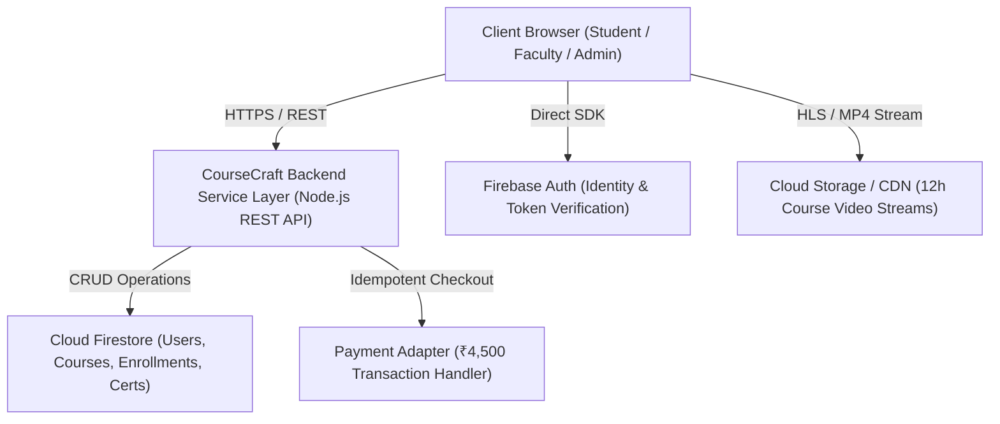

# Software Requirements Specification (SRS)
## CourseCraft — Online Course Platform for University Continuing Education Centre
**Subject:** Software Engineering & Project Management (SEPM)  
**Academic Program:** B.Tech Computer Science & Engineering (2025–29), Semester III  
**Case Study No:** 108  
**Standard:** IEEE Std 830-1998  
**Document Revision:** 1.0 (Production Release)  
**Target Platform:** CourseCraft Full-Stack Academic Platform (Connected to Firebase: `coursecraft-c31f9`)

---

## 1. Introduction

### 1.1 Purpose
This document specifies the software requirements for **CourseCraft**, an online course delivery and management platform developed for the University's Continuing Education Centre (CEC). CourseCraft is designed to deliver university-accredited technical short courses, facilitate asynchronous video instruction, evaluate student competencies through timed 10-question assessments with a strict 70% passing threshold, process ₹4,500 course fees, issue verifiable certificates, and provide faculty recording progress tracking alongside executive administrator analytics.

### 1.2 Scope
CourseCraft provides:
- A catalog of **30 planned university short courses** (12 hours of recorded video content per course).
- An initial launch cohort of **8 courses** (288 effort hours / 4.8 weeks of editing) ready for deployment alongside the 10-week platform software development cycle.
- A remaining pipeline of **22 courses** requiring total editing effort of 1,080 hours (18.0 weeks at 60 hours/week combined capacity from 2 editors).
- Cloud persistence and authentication integrated with the university's live Firebase project (`coursecraft-c31f9`).
- Loosely coupled architecture separating video delivery, payment processing, authentication, and grading engines.
- Annual revenue tracking targeting ₹54,00,000 for 8 courses and ₹2,02,50,000 for all 30 courses based on ₹4,500 per enrolment and 150 students/course/year.

### 1.3 Definitions, Acronyms, and Abbreviations
| Term | Definition |
| :--- | :--- |
| **CEC** | Continuing Education Centre |
| **CPM** | Critical Path Method |
| **BVA** | Boundary Value Analysis |
| **EP** | Equivalence Partitioning |
| **DRE** | Defect Removal Efficiency ($DRE = \frac{E}{E + D}$) |
| **RMMM** | Risk Mitigation, Monitoring, and Management |
| **RTM** | Requirements Traceability Matrix |
| **RBAC** | Role-Based Access Control |
| **WBS** | Work Breakdown Structure |
| **SLO** | Service Level Objective |

### 1.4 References
- IEEE Std 830-1998: *Recommended Practice for Software Requirements Specifications*.
- Project Management Institute (PMI): *A Guide to the Project Management Body of Knowledge (PMBOK Guide)*.
- Case Study No. 108: *Continuing Education Online Course Delivery Constraints & Timelines*.

---

## 2. Overall Description

### 2.1 Product Perspective
CourseCraft operates as a 3-tier full-stack web application with a cloud persistence layer powered by Google Firebase (Cloud Firestore, Firebase Authentication, Cloud Storage) and an asynchronous Node.js REST service layer.

### 2.2 Product Functions
1. **Catalog Exploration & Filtering:** Public discovery across 30 short courses by domain, level, and production status.
2. **Identity & RBAC:** Multi-role authentication for Students, Faculty instructors, and University Administrators.
3. **Course Enrolment & Payment:** ₹4,500 fee transaction processing with receipt generation and enrollment state initialization.
4. **Interactive 12h Video Studio:** Streaming video playback, 4 structured modules, lesson mark-complete triggers, and telemetry tracking.
5. **10-Question Certification Exam:** Timed quiz execution with automated evaluation against the 70% passing threshold.
6. **Verified Certificate Issuance:** Cryptographic certificate generation with unique Certificate IDs, verification QR data, and print export.
7. **Faculty 12h Recording Studio:** Quota logging, 3:1 editing ratio monitoring, and curriculum management.
8. **Executive Dean Control Center:** Dual-track CPM schedule comparison (18w content vs 10w software) and ₹2.02 Cr revenue tracking.

### 2.3 User Classes and Characteristics
- **Students:** Enrolled learners seeking technical certifications. Require intuitive video playback, notes, and quiz interfaces.
- **Faculty Instructors:** Course creators and professors managing 12 hours of video curriculum and 10-question assessment banks.
- **University Administrators:** Deans and academic coordinators monitoring enrollment revenues, editing bottlenecks, and certificate authenticity.

### 2.4 Operating Environment
- **Server:** Node.js 16+ on Linux / macOS / Windows / Cloud Container.
- **Client:** Modern web browsers (Chrome 90+, Firefox 88+, Safari 14+, Edge 90+) with ES6+ support.
- **Database & Identity:** Cloud Firestore and Firebase Auth (`coursecraft-c31f9`).

### 2.5 Design and Implementation Constraints
- **Content Production Bottleneck:** 2 video editors working 30 hrs/week = 60 hours/week combined capacity. Full 30 courses require 1,080 editing hours = 18.0 weeks.
- **Software Timeline:** Platform development requires 10.0 weeks. Initial 8 courses require 288 editing hours = 4.8 weeks, enabling prompt launch at Week 10.
- **Standardized Course Pricing:** Fixed at ₹4,500 INR per course.
- **Grading Standard:** Fixed 70% passing score (7/10 questions correct) on all course certification exams.

---

## 3. Specific Requirements
*(See [Requirements.md](file:///Users/swetapopatkadam/Downloads/CourseCraft/docs/Requirements.md) for detailed FR-01 to FR-12 and [NFR.md](file:///Users/swetapopatkadam/Downloads/CourseCraft/docs/NFR.md) for measurable NFRs).*
