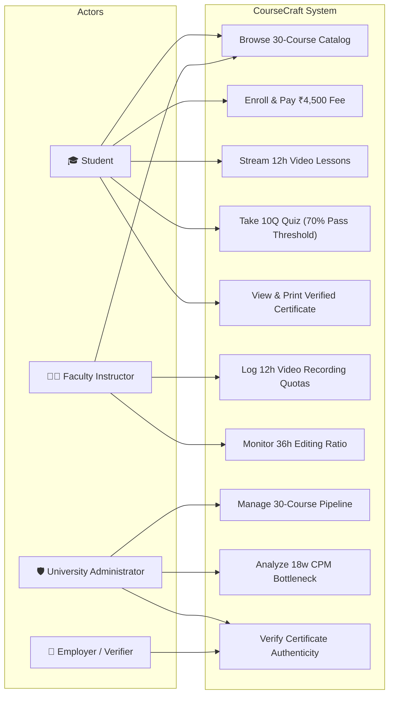
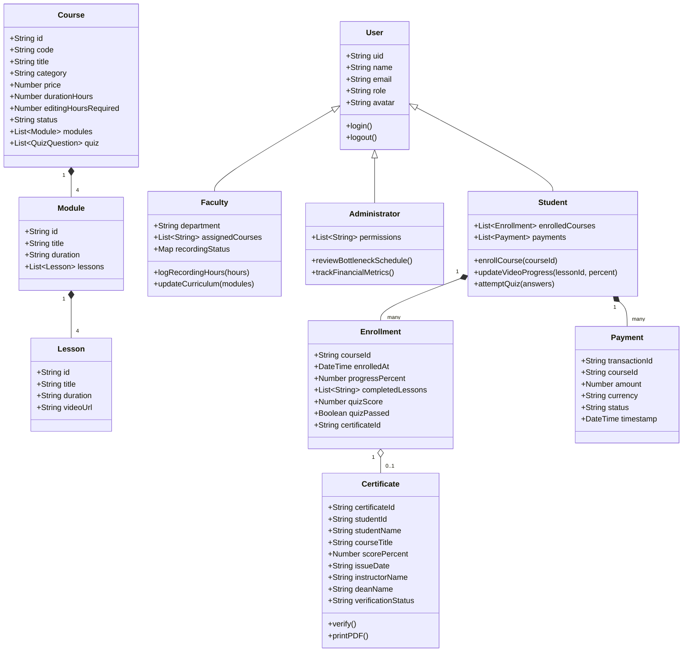
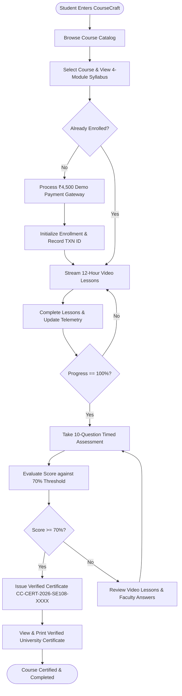
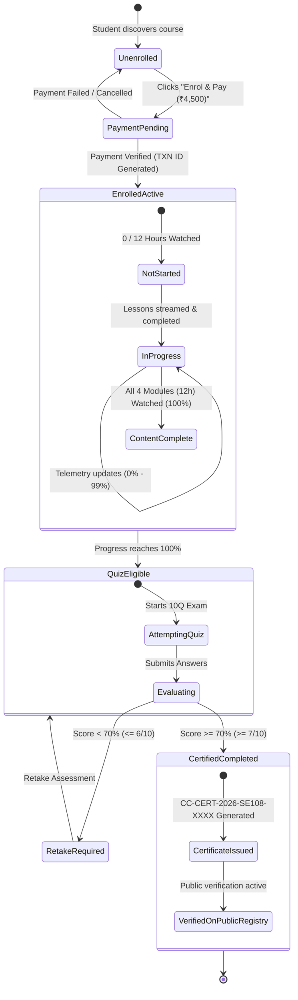
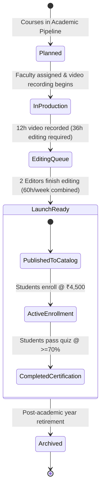

# Unified Modeling Language (UML) Diagrams
## CourseCraft — Case Study No. 108

---

### 1. Use Case Diagram
Visualizes the primary interactions between the actors (Student, Faculty, Administrator, Employer) and CourseCraft platform subsystems.

---

### 2. Class Diagram
Represents the object-oriented structure, domain models, entity relationships, and operations.

---

### 3. Sequence Diagram: Enrol, Watch Lessons and Earn a Certificate
Illustrates the complete end-to-end lifecycle specified in Case Study No. 108: enrolment & payment, lesson streaming & progress telemetry, and assessment with 70% threshold certificate generation.

```mermaid
sequenceDiagram
    autonumber
    actor Student as 🎓 Student
    participant UI as 🖥️ Client Portal (Web UI)
    participant CourseSvc as ⚙️ CourseService
    participant PayGateway as 💳 Payment Gateway
    participant VideoPlayer as 🎬 Video Delivery Studio
    participant API as 🌐 REST Backend Server
    participant DB as 🔥 Database (Firestore/JSON)

    %% Step 1: Enrolment & Payment
    Note over Student, PayGateway: 1. Course Discovery & Enrolment
    Student->>UI: Selects Course (e.g., CSE-101) & clicks "Enrol & Pay"
    UI->>CourseSvc: initiateEnrollment(courseId, studentId)
    CourseSvc->>PayGateway: processPayment(studentId, courseId, amount=₹4500)
    PayGateway-->>CourseSvc: 200 OK {status: "APPROVED", txnId: "TXN-CC-2026-XXXX"}
    CourseSvc->>API: POST /api/enroll {studentId, courseId, txnId}
    API->>DB: Record Enrollment (status="ACTIVE", progress=0%)
    API-->>UI: Enrollment Confirmed & Studio Unlocked

    %% Step 2: Watch Lessons
    Note over Student, VideoPlayer: 2. Video Streaming & Progress Telemetry
    Student->>UI: Opens Learning Studio (learn.html)
    UI->>VideoPlayer: Load Module 1 Lesson 1 (12h curriculum)
    VideoPlayer->>Student: Streams HTML5 video content
    Student->>VideoPlayer: Completes lesson (video ended event)
    VideoPlayer->>CourseSvc: updateLessonProgress(courseId, lessonId, percent)
    CourseSvc->>API: POST /api/progress/update {progress: 100%}
    API->>DB: Save updated progress (progressPercent=100%)
    API-->>UI: All 4 Modules Complete -> Assessment Unlocked

    %% Step 3: Assessment & Certification
    Note over Student, DB: 3. Assessment & 70% Passing Threshold Evaluation
    Student->>UI: Opens 10-Question Certification Exam (quiz.html)
    Student->>UI: Submits 10 question answers
    UI->>API: POST /api/courses/:id/quiz/submit {answers, studentId}
    
    rect rgb(20, 35, 70)
        Note over API: Compute Score: (correct / 10) * 100
        alt Score >= 70% (Pass: 7 to 10 correct)
            API->>API: Generate Cryptographic Certificate ID (CC-CERT-2026-SE108-XXXX)
            API->>DB: Save Certificate Record & Set quizPassed=true
            API-->>UI: 200 OK {passed: true, score: 90, certificate: {...}}
            UI->>Student: Displays Official Printable University Certificate
        else Score < 70% (Fail: <= 6 correct)
            API->>DB: Record attempt & Set quizPassed=false
            API-->>UI: 200 OK {passed: false, score: 60, diagnosticNotes: "Review Modules 2 & 4"}
            UI->>Student: Prompts lesson review & retake option
        end
    end
```

---

### 4. Activity Diagram: Student Learning & Certification Flow

---

### 5. State Machine Diagram: Enrolment Lifecycle (Case Study 108)
Models the dynamic states of a student's enrolment from initial checkout through certification.

---

### 6. State Machine Diagram: Academic Course Catalog Lifecycle

